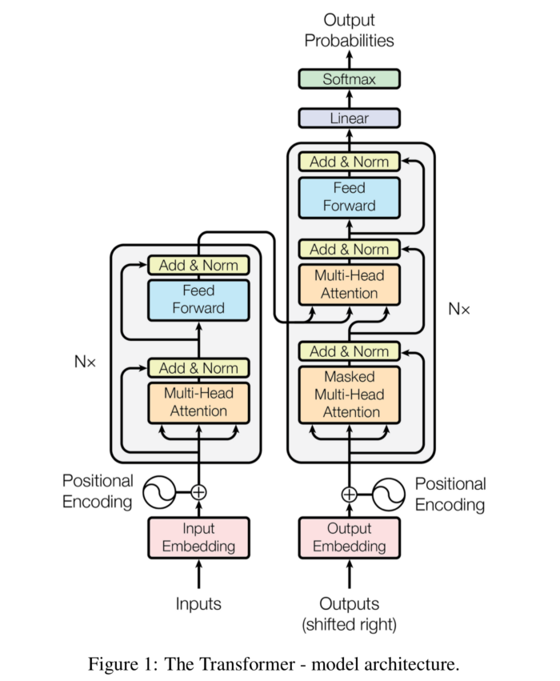
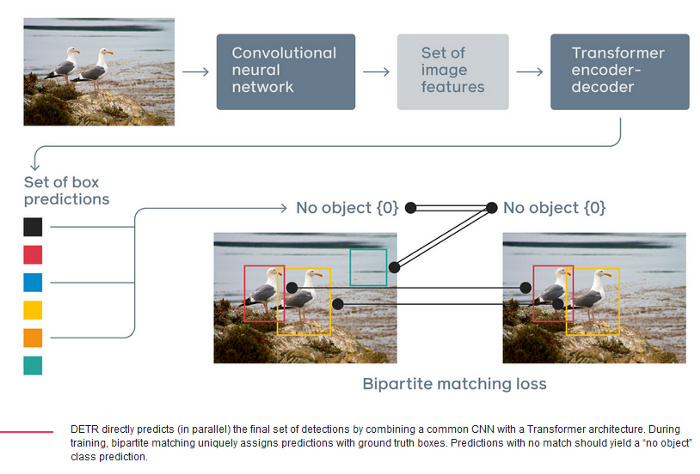
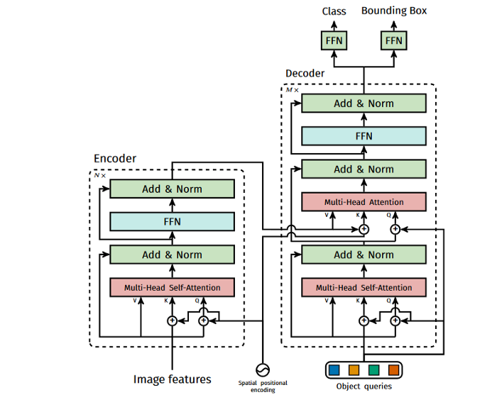
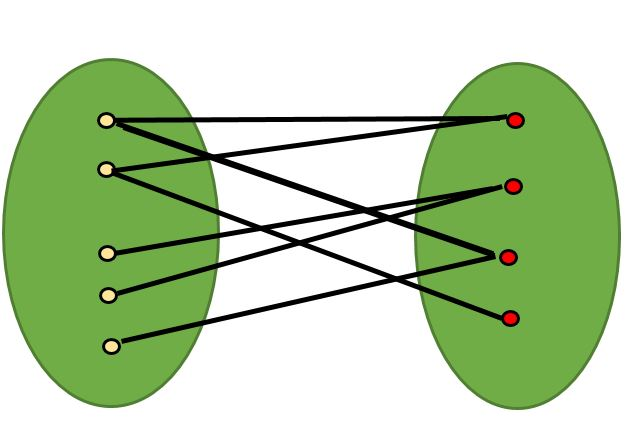
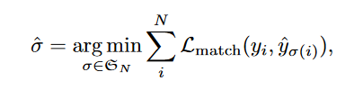

<!-- # All About Detr

DETR stands for DEtection TRansformer, is a end to end object detection and segmentation model by FAIR.

Q: We take the encoded image (dxH/32xW/32) and send it to Multi-Head Attention?

A: We Pass out image input image to backbone (example ResNet50) which gives us features this features is then passed on to transformer which gives us this hidden state that is (d, h/32, w/32)

Q: We do something here to generate NxMxH/32xW/32 maps?

A: We apply Einstein summation convention, to convert `bqnc,bnchw->bqnhw`
    
    torch.einsum("bqnc,bnchw->bqnhw", qh * self.normalize_fact, kh)

Q: Then we concatenate these maps with Res5 Block

A: These features are comming from backbone feature layers.

References: 

* https://github.com/waspinator/pycococreator -->

# DETR in depth

In DETR, object detection problem is modeled as a direct set prediction problem. This approach does not require hand crafted algorithms like `non-maximum suppression` procedure or `anchor generation` that explicitly encode our prior knowledge about the task. It makes the detection pipeline a simple end to end unified architecture. The two components of the new framework, called `DEtection TRansformer or DETR`

* Set-based global loss that forces unique predictions via bipartite matching.
* Transformer encoder-decoder architecture.

Given a fixed small set of learned object queries, DETR reasons about relations of  objects and global image context to directly output final set of predictions in parallel.

**How DETR differs from other object detection methods?**

DETR formulates the object detection task as an image-to-set problem. Given an image, the model predicts an unordered set of all objects present, each represented by its class and tight bounding box surrounding each one. Transformer then acts as a reasoning agent between the image features and the prediction.

## What is a transformer?

The paper ‘Attention Is All You Need’ introduces a novel architecture called Transformer. As the title indicates, it uses the attention-mechanism. Like LSTM, Transformer is an architecture for transforming one sequence into another one with the help of two parts (Encoder and Decoder), but it differs from the previously described/existing sequence-to-sequence models because it does not imply any Recurrent Networks (GRU, LSTM, etc.)

In the above architecture lest part is Encoder and right part us Decoder. Both Encoder and Decoder are composed of modules that can be stacked on top of each other multiple times, which is shown as `Nx` above. These modules consist mainly of Multi-Head Attention and Feed Forward layers. 

> Transformers rely on a simple yet powerful mechanism called attention, which enables AI models to selectively focus on certain parts of their input and thus reason more effectively.

Transformers have been widely applied on problems with sequential data, in particular in natural language processing (NLP) tasks such as [language modeling](https://ai.facebook.com/blog/roberta-an-optimized-method-for-pretraining-self-supervised-nlp-systems/) and [machine translation](https://ai.facebook.com/blog/facebook-leads-wmt-translation-competition/), and have also been extended to tasks as diverse as [speech recognition](https://engineering.fb.com/ai-research/wav2letter/), [symbolic mathematics](https://ai.facebook.com/blog/using-neural-networks-to-solve-advanced-mathematics-equations/), and [reinforcement learning](https://arxiv.org/abs/2002.09402). But, perhaps surprisingly, computer vision was not swept up by the Transformer revolution before DETR came into existance.

> DETR completely changes the architecture compared with previous object detection systems. It is the first object detection framework to successfully integrate Transformers as a central building block in the detection pipeline

## DETR Pipeline

At a high level these are the tasks detr perform 

1. Calculate image features from a backbone.
2. Transform image features using Encoder Decoder Architecture.
3. Calculate Set loss function which performs bipartite matching between predicted and ground-truth objects to remove false or extra detection's.

## DETR Architecture

DETR is very simple model it basically contains three different parts.

1. CNN backbone to extract a compact feature representation (we have used resnet 50 trained on image net)
2. An encoder-decoder transformer
3. A simple feed forward network (FFN) that makes the final detection prediction

### Backbone

The authors have used ResNet50 as the backbone of DETR. Ideally, any backbone can be used depending upon the complexity of the task at hand

Backbones provide low dimensional representation of the image having refined features.

Before we move to details of transformer encoder and decoder, I recommend you to go through this great [explanation](https://medium.com/inside-machine-learning/what-is-a-transformer-d07dd1fbec04) before proceeding further.

### Transformer

As you can see, it is very similar to the original transformer block with minute differences adjusted to this task.

#### Encoder

First, a 1x1 convolution reduces the channel dimension of the high-level activation map from C to a smaller dimension d, creating a new feature map d×H×W. The encoder expects a sequence as input so it is collapsed to one dimension, resulting in a d×HW feature map.

Each encoder layer has a standard architecture and consists of a multi-head self-attention module and a feed forward network (FFN).

Since the transformer architecture is permutation-invariant, they supplement it with fixed positional encodings that are added to the input of each attention layer.

#### Decoder

The decoder follows the standard architecture of the transformer, transforming N embeddings of size d using multi-headed self-attention and encoder-decoder attention mechanisms.

The difference with the original transformer is that DETR model decodes the N objects in parallel at each decoder layer.

These N input embeddings are learnt positional encodings that they refer to as object queries, and similarly to the encoder, they are added them to the input of each attention layer.

The N object queries are transformed into an output embedding by the decoder. They are then independently decoded into box coordinates and class labels by a feed forward network (FFN), resulting N final predictions.

> Using self-attention and encoder-decoder attention over these embeddings, the model makes a judgement about all objects based on entire context of an image using pair-wise relations between them.

The decoder receives queries (initially set to zero), output positional encoding (object queries), and encoder memory, and produces the final set of predicted class labels and bounding boxes through multiple multi-head self-attention and decoder-encoder attention. The first self-attention layer in the first decoder layer can be skipped.

#### Feed-Forward Network(FFN)

FNN is a 3-layer perceptron with ReLU activation function and hidden dimension `d`, and a linear projection layer. FFN layers are effectively multi-layer 1x1 convolutions, which have `Md` input and output channels.

The FFN predicts the normalized center coordinates, height and width of the box w.r.t. the input image, and the linear layer predicts the class label using a softmax function.

Since we predict a fixed-size set of N bounding boxes, where N is usually much larger than the actual number of objects of interest in an image, an additional special class label `∅` is used to represent that `no object` is detected within a slot. This class plays a similar role to the “background” class in the standard object detection approaches.

## Loss Function

The following explanation may seem a lot to grasp but trust me when you read it carefully it is just two simple steps

1. Calculate the best match of predictions with respect to given ground truths using a graph technique with a cost function

2. Next, we define a loss to penalize the class and box predictions

 

**What is bipartite matching?**

A Bipartite Graph is a graph whose vertices can be divided into two independent sets, U and V such that every edge (u, v) either connects a vertex from U to V or a vertex from V to U. In other words, for every edge (u, v), either u belongs to U and v to V, or u belongs to V and v to U. We can also say that there is no edge that connects vertices of same set.

In object detection context, we have to find best predicted box for a given ground truth. This part eliminates the need of Non Maximum Suppression(NMS) and the anchors used in the object detectors of today.

The loss function is an optimal bipartite matching function. Which Does the following

* Let **_y_** to be the number of ground truths in the image I.
* Let **_y__** be the number of predictions by the network.

**y_** is fixed to the value `N` which is assumed to be much larger than overall predictions in any image. The (actual predictions + the remaining ones are padded as no object labels ) equates to `N`

Next, they find a bipartite matching between these two sets using a matching function across a permutation of N elements with the lowest cost as follows:

where __L match(yi,ˆyσ(i))__ is a pair-wise matching cost between ground truth yi and a prediction with index __σ(i)__. It is formulated as an assignment problem with m ground truth and n predictions and is computed efficiently with the Hungarian algorithm over `m x n` matrix.

The matching cost takes into account both the class prediction(classification) and the similarity of predicted and ground truth boxes(regression).

# References

* https://www.geeksforgeeks.org/bipartite-graph/
* https://medium.com/visionwizard/detr-b677c7016a47
