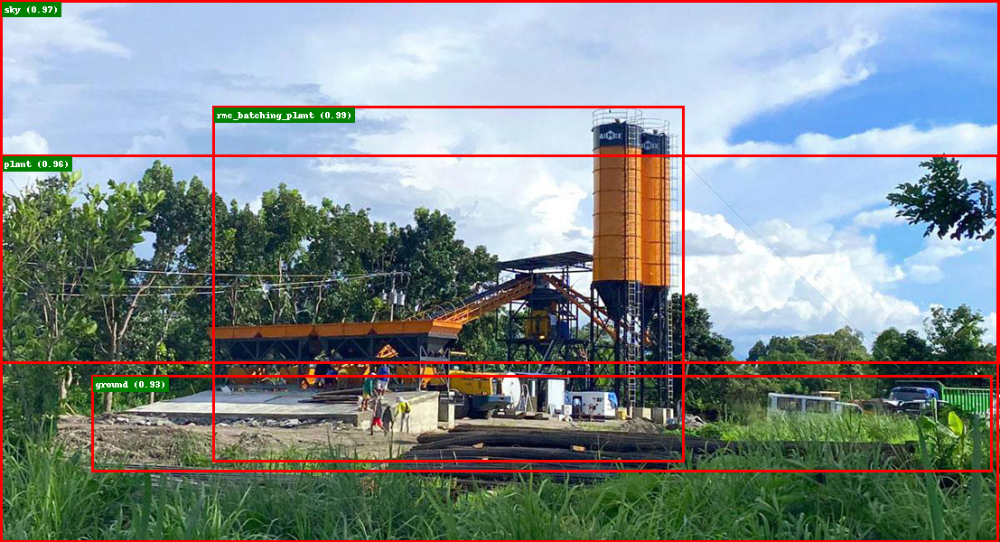

<!-- vscode-markdown-toc -->
1. [COCO Format for Object detection](#COCOFormatforObjectdetection)
	* 1.1. [COCO file format](#COCOfileformat)
	* 1.2. [Folder Structure](#FolderStructure)
	* 1.3. [JSON format](#JSONformat)
2. [Creating a Custom COCO format dataset](#CreatingaCustomCOCOformatdataset)
	* 2.1. [Background](#Background)
	* 2.2. [Add Masks for Stuff Classes](#AddMasksforStuffClasses)
	* 2.3. [Example Mask Image](#ExampleMaskImage)
3. [Implement RICAP](#ImplementRICAP)
	* 3.1. [Example RICAP Images](#ExampleRICAPImages)
4. [Fine Tune DETR on custom dataset for Object Detection](#FineTuneDETRoncustomdatasetforObjectDetection)
	* 4.1. [Prepare Code](#PrepareCode)
	* 4.2. [Train Model](#TrainModel)
5. [Example Predictions](#ExamplePredictions)
6. [References:](#References:)

<!-- vscode-markdown-toc-config
	numbering=true
	autoSave=true
	/vscode-markdown-toc-config -->
<!-- /vscode-markdown-toc -->

# Train DETR for object detection on custom data

In Computer Vision, object detection is a task where we want our model to distinguish the foreground objects from the background and predict the locations and the categories for the objects present in the image.

There are many frameworks out there for object detection but the researchers at Facebook AI has come up with DETR, an innovative and efficient approach to solve the object detection problem.

DETR treats an object detection problem as a direct set prediction problem with the help of an encoder-decoder architecture based on transformers. By set, I mean the set of bounding boxes. Transformers are the new breed of deep learning models that have performed outstandingly in the NLP domain. This is the first time when someone used transformers for object detection.
The authors of this paper have evaluated DETR on one of the most popular object detection datasets, COCO, against a very competitive Faster R-CNN baseline.

In the results, the DETR achieved comparable performances. More precisely, DETR demonstrates significantly better performance on large objects. However, it didn’t perform that well on small objects.

The Defacto standard to train any object detection model is to use COCO format. To train our model for object detection task we have to prepare our dataset in standard coco format

##  1. COCO Format for Object detection

Microsoft's Common Objects in Context dataset (COCO) is the most popular object detection dataset at the moment. It is widely used to benchmark the performance of computer vision methods.

Due to the popularity of the dataset, the format that COCO uses to store annotations is often the go-to format when creating a new custom object detection dataset. While the COCO dataset also supports annotations for other tasks like segmentation, I will leave that to a future blog post. For now, we will focus only on object detection data.

The “COCO format” is a specific JSON structure dictating how labels and metadata are saved for an image dataset.

###  1.1. COCO file format

If you are new to the object detection space and are tasked with creating a new object detection dataset, then following the [COCO format](https://cocodataset.org/#format-data) is a good choice due to its relative simplicity and widespread usage. This section will explain what the file and folder structure of a COCO formatted object detection dataset actually looks like.
At a high level, the COCO format defines exactly how your annotations (bounding boxes, object classes, etc) and image metadata (like height, width, image sources, etc) are stored on disk.

###  1.2. Folder Structure

The folder structure of a COCO dataset looks like this:

    <dataset_dir>/
        data/
            <filename0>.<ext>
            <filename1>.<ext>
            ...
        labels.json

The dataset is stored in a directory containing your raw image data and a single json file that contains all of the annotations, metadata, categories, and other information that you could possibly want to store about your dataset. If you have multiple splits of data, they would be stored in different directories with different json files.

###  1.3. JSON format

If you were to download the [COCO dataset from their website](https://cocodataset.org/#download), this would be the `instances_train2017.json` and `instances_val2017.json` files.

    {
        "info": {
            "year": "2021",
            "version": "1.0",
            "description": "Exported from FiftyOne",
            "contributor": "Voxel51",
            "url": "https://fiftyone.ai",
            "date_created": "2021-01-19T09:48:27"
        },
        "licenses": [
            {
            "url": "http://creativecommons.org/licenses/by-nc-sa/2.0/",
            "id": 1,
            "name": "Attribution-NonCommercial-ShareAlike License"
            },
            ...   
        ],
        "categories": [
            ...
            {
                "id": 2,
                "name": "cat",
                "supercategory": "animal"
            },
            ...
        ],
        "images": [
            {
                "id": 0,
                "license": 1,
                "file_name": "<filename0>.<ext>",
                "height": 480,
                "width": 640,
                "date_captured": null
            },
            ...
        ],
        "annotations": [
            {
                "id": 0,
                "image_id": 0,
                "category_id": 2,
                "bbox": [260, 177, 231, 199],
                "segmentation": [...],
                "area": 45969,
                "iscrowd": 0
            },
            ...
        ]
    }

* **Info** — Description and versioning information about your dataset.

* **Licenses** — List of licenses with unique IDs to be specified by your images.

* **Categories** — Classification categories each with a unique ID. Optionally associated with a supercategory that can span multiple classes. These categories can be whatever you want, but note that if you’d need to follow the COCO classes if you want to use a model pretrained on COCO out of the box (or follow other dataset categories to use other models).

* **Images** — List of images in your dataset and relevant metadata including unique image ID, filepath, height, width, and optional attributes like license, URL, date captured, etc.

* **Annotations** — List of annotations each with a unique ID and the image ID it relates to. This is where you will store the bounding box information in our case or segmentation/keypoint/other label information for other tasks. This also stores bounding box area and iscrowd indicating a large bounding box surrounding multiple objects of the same category which is used for evaluation.

##  2. Creating a Custom COCO format dataset

###  2.1. Background
 
If you only have unlabeled images, then you will first need to generate object labels. You can generate either ground truth labels with an annotation tool or provider (like CVAT, Labelbox, MTurk, or one of many others) or predicted labels with an existing pretrained model.

In our case we have used CVAT to create labelled dataset. The unlabeled data consists of images from construction site which contains following classes.

    [
        "aac_blocks",
        "adhesives",
        "ahus",
        "aluminium_frames_for_false_ceiling",
        "chiller",
        "concrete_mixer_machine",
        "concrete_pump",
        "control_panel",
        "cu_piping",
        "distribution_transformer",
        "dump_truck_tipper_truck",
        "emulsion_paint",
        "enamel_paint",
        "fine_aggregate",
        "fire_buckets",
        "fire_extinguishers",
        "glass_wool",
        "grader",
        "hoist",
        "hollow_concrete_blocks",
        "hot_mix_plant",
        "hydra_crane",
        "interlocked_switched_socket",
        "junction_box",
        "lime",
        "marble",
        "metal_primer",
        "pipe_fittings",
        "rcc_hume_pipes",
        "refrigerant_gas",
        "river_sand",
        "rmc_batching_plant",
        "rmu_units",
        "sanitary_fixtures",
        "skid_steer_loader",
        "smoke_detectors",
        "split_units",
        "structural_steel_channel",
        "switch_boards_and_switches",
        "texture_paint",
        "threaded_rod",
        "transit_mixer",
        "vcb_panel",
        "vitrified_tiles",
        "vrf_units",
        "water_tank",
        "wheel_loader",
        "wood_primer",
    ]

Each person was tasked to pick one class and collect images containing object for that class. These images were then uploaded to CVAT where only one class was annotated per image.

At the end of this excercise we had a number of folders each containing json file in coco format for that class annotation

    ├── aac_blocks
    │   ├── class_details.txt
    │   ├── coco.json
    │   └── images
    │       ├── img_000.png
    │       ├── img_001.png
    ├── adhesives
    │   ├── class_details.txt
    │   ├── coco.json
    │   └── images
    │       ├── img_000.png
    │       ├── img_001.png
    .
    .

As per thge standard coco format we need one `test` and one `train` file. So our next task is to combine that datset to make it one.

Before starting to create a consolidated dataset, the classes mentioned above just belongs to `things` category. But for a true panoptic segmentation we also need our dataset to include stuffs classes. In coco dataset following are the things and stuff classes.

From the above image we took all low level categories and mapped them to high level categories.

    [
        {"id": 1, "name": "misc"},
        {"id": 2, "name": "textile"},
        {"id": 3, "name": "building"},
        {"id": 4, "name": "rawmaterial"},
        {"id": 5, "name": "furniture"},
        {"id": 6, "name": "floor"},
        {"id": 7, "name": "plant"},
        {"id": 8, "name": "food"},
        {"id": 9, "name": "ground"},
        {"id": 10, "name": "structural"},
        {"id": 11, "name": "water"},
        {"id": 12, "name": "wall"},
        {"id": 13, "name": "window"},
        {"id": 14, "name": "ceiling"},
        {"id": 15, "name": "sky"},
        {"id": 16, "name": "solid"},
    ]

What ever we have done till now is the most easy task, now the most important step is to find masks and bounding boxes for these mentioned categories in out custom dataset images.

###  2.2. Add Masks for Stuff Classes

As we already know DETR is trained to find both stuffs and things classes. We will use pretrained DETR model to predict these low level stuff classes and map them to highlevel stuff classes.

We will use following script to do so

**Step 1:** Clone DETR Repo

    git clone https://github.com/facebookresearch/detr.git

    # Add detr folder to system path so that we can load modules from detr repo
    import sys
    sys.path.append(os.path.join(os.getcwd(), "detr/"))

**Step 2:** Load Liberaries, some of these are included from custom code we have written.

    import random
    import shutil
    import sys

    import cv2

    from categories_meta import COCO_CATEGORIES, COCO_NAMES
    from panopticapi.utils import id2rgb, rgb2id
    import panopticapi
    from PIL import Image, ImageDraw, ImageFont
    import requests
    import json
    import io
    import math
    import matplotlib.pyplot as plt
    # %config InlineBackend.figure_format = 'retina'
    import itertools

    import torch
    from torch import nn
    import torchvision.transforms as T
    import numpy as np

    torch.set_grad_enabled(False)
    # Create Original Segmented Image
    import overlay_custom_mask
    import convert_to_coco

    from categories_meta import COCO_CATEGORIES, NEW_CATEGORIES, MAPPINGS, INFO, LICENSES, cat2id, id2cat
    import coco_creator_tools

    import datetime
    import time
    import json
    import traceback

**Step 3:** Load Detr Model

    # standard PyTorch mean-std input image normalization
    transform = T.Compose([
        T.Resize(800),
        T.ToTensor(),
        T.Normalize([0.485, 0.456, 0.406], [0.229, 0.224, 0.225])
    ])

    # Load detr model
    model, postprocessor = torch.hub.load('detr', 'detr_resnet101_panoptic', source='local', pretrained=True, return_postprocessor=True, num_classes=250)
    # Convert to eval mode
    model = model.to(device)
    model.eval()

**Step 4:** Get path to all folders containing annotations per category 

    import glob

    category_paths = glob.glob('./data/construction/*')

**Step 5:** Initialize Variables

    ROOT_DIR = './data'

    processing_file = ""
    processing_data = []

    image_id = 1
    annotation_id = 1
    segment_id = 1

    GLOBAL_COCO = {
        "licenses": LICENSES,
        "info": INFO,
        "categories": NEW_CATEGORIES,
        "annotations": [],
        "images": []
    }

    GLOBAL_PANOPTIC = {
        "licenses": LICENSES,
        "info": INFO,
        "categories": NEW_CATEGORIES,
        "annotations": [],
        "images": []
    }

**Step 6:** Run through one categoiry at a time, first coco file for that category and parse in right format. 

    ############################ Create DATASET ################################

    # run through all folders in dataset
    for category_path in category_paths:
        # store starting time
        start = time.time()
        # get category name
        category_name = category_path.split("/")[5]
        print("Processing Category:", category_name)
        # open category coco file
        with open(os.path.join(category_path, "coco.json"), "r") as coco_file:
            category_coco = json.load(coco_file)
            
        images_root = os.path.join(category_path, 'images')

**Step 7:** Create a temperary structure for images and their respective annotations

        # Process all images
        ## 1. Create a temp json which contains each image and its annotations
        ## 2. Run over this list
        ### 1. Copy this image as .jpg in GLOBAL_DIR
        ### 2. Find all segments for this image
        ### 3. Create new anotation segment which includes annotations from custom classes
        
        TEMP_COCO_IMAGES = {}
        
        # Run over all images
        for im in category_coco["images"]:
            im['annotations'] = []
            TEMP_COCO_IMAGES[im['id']] = im
            
        for ann in category_coco["annotations"]:
            TEMP_COCO_IMAGES[ann['image_id']]["annotations"].append(ann)

**Step 8:** Loop over one image at a time, as we are also going to save these images as `three channel .jpg` image we create their destinatio names

        for i, image_coco in TEMP_COCO_IMAGES.items():
            # get image path
            ## This data can be used further for logging if failed while processing
            processing_file = os.path.join(images_root, image_coco['file_name'])
            processing_data = image_coco
            output_file_name = category_name + "_" + str(image_id) + ".jpg"
            output_file_path = os.path.join(ROOT_DIR, "images", output_file_name)
            
            output_mask_name = category_name + "_" + str(image_id) + ".png"
            output_mask_path = os.path.join(ROOT_DIR, "masks", output_mask_name)

**Step 9:** Now we will read image and convert them into RGB format with 3 channels as there might be some images which are in gray format and others might be in RGBN format.

            try:

                # Read this image and get shape of image
                imo = Image.open(processing_file).convert('RGB')

                try:
                    h, w, c = np.array(imo).shape
                except:
                    h, w = np.array(imo).shape
                    c = 1

                # if no of channels != 3, open the image and convert it to 3 channel - RGB
                if c == 4 or c == 1:
                    imo = imo.convert('RGB')
                    h, w, c = np.array(imo).shape

                # Create a copy of image this will be used for further processing
                im = imo.copy()

                # Apply transform and convert image to batch
                # mean-std normalize the input image (batch-size: 1)
                img = transform(im).unsqueeze(0).to(device)  # [h, w, c] -> [1, c, ht, wt]

**Step 10:** Now we pass this formated image to model and get predicted output

                # Generate output for image
                out = model(img)

**Step 11:** Now we filter results to get all predictions above certain threshold (0.85 for us), also we pass this prediction through postprocessor to get panoptic outputs

                # Generate score
                # compute the scores, excluding the "no-object" class (the last one)
                scores = out["pred_logits"].softmax(-1)[..., :-1].max(-1)[0]

                # threshold the confidence
                keep = scores > 0.85

                # Keep only ones above threshold
                pred_logits, pred_boxes = out["pred_logits"][keep][:, :len(
                    COCO_NAMES) - 1], out["pred_boxes"][keep]

                # the post-processor expects as input the target size of the predictions (which we set here to the image size)
                result = postprocessor(out, torch.as_tensor(img.shape[-2:]).unsqueeze(0))[0]

**Step 12:** These postprocessed results contain mask image as a png_string, lets load this string as an image

                # The segmentation is stored in a special-format png
                panoptic_seg = Image.open(io.BytesIO(result['png_string'])).resize((w, h), Image.NEAREST)
                # (wp, hp) = panoptic_seg.size
                panoptic_seg = np.array(panoptic_seg, dtype=np.uint8).copy()

                # We retrieve the ids corresponding to each mask
                panoptic_seg_id = rgb2id(panoptic_seg)

**Step 13:** In this step we will overlay the predictions with our own custom masks.

                ## Merge predicted annotations
            
                # 1. Get Mapping from predicted id to new ids
                ## 1. Merge segment ids
                unique_category_id = []
                for i, segment in enumerate(result['segments_info']):
                    result['segments_info'][i]["category_id"] = MAPPINGS[result['segments_info'][i]["category_id"]]
                    if result['segments_info'][i]["category_id"] not in unique_category_id:
                        unique_category_id.append(result['segments_info'][i]["category_id"])
                
                # Sort array
                unique_category_id.sort()
                
                unique_category_id_to_id =  {category_id: i for i, category_id in enumerate(unique_category_id)}
                unique_id_to_category_id =  {i: category_id for category_id, i in unique_category_id_to_id.items()}
                
                for i, segment in enumerate(result['segments_info']):
                    result['segments_info'][i]["new_id"] = unique_category_id_to_id[result['segments_info'][i]["category_id"]]
                
                # Update original panoptic_seg_id array with new ids as the new segmentation combines different categories.
                custom_panoptic_seg_id = np.zeros((panoptic_seg_id.shape[0], panoptic_seg_id.shape[1]), dtype=np.uint8)
                
                # Update this custom panoptic seg matrix
                for i, segment in enumerate(result['segments_info']):
                    custom_panoptic_seg_id[result['segments_info'][i]['id'] == panoptic_seg_id] = result['segments_info'][i]['new_id']

**Step 14:** Once we have new mask array its time to get segments for each category.

                custom_panoptic_segments_info = []
                for category_id in unique_category_id:
                    custom_panoptic_segments_info.append({
                        'segment_id': unique_category_id_to_id[category_id], 
                        'category_id': category_id,
                        'bbox': [],
                        'area': 0,
                        'iscroud': 0,
                        'isthing': 0
                    })

                # annotations of our construction things
                omask = processing_data['annotations']
                
                TEMP_ANNOTATIONS = []
                
                # Overlay things mask one at a time
                for annotation in omask:
                    # overlay mask of construction things on top of detr output
                    omask_image_id = overlay_custom_mask.get_overlayed_mask((h, w), annotation)
                    custom_panoptic_seg_id[omask_image_id.astype(np.bool_)] = custom_panoptic_seg_id.max() + 1
                    custom_panoptic_segments_info.append({
                        'segment_id': custom_panoptic_seg_id.max(), 
                        'category_id': cat2id[category_name], 
                        'bbox': annotation['bbox'],
                        'area': annotation['area'],
                        'iscroud': 0,
                        'isthing': 1
                    })

                    # append annotation of construction things in json file
                    annotation["category_id"] = cat2id[category_name]
                    annotation["image_id"] = image_id
                    TEMP_ANNOTATIONS.append(annotation)
                
                # Convert to binary segment
                binary_masks = np.zeros((
                    custom_panoptic_seg_id.max() + 1,
                    custom_panoptic_seg_id.shape[0],
                    custom_panoptic_seg_id.shape[1]),
                    dtype=np.uint8
                )

                # for each binary mask, detect contours and create annotation for those contours
                if len(unique_category_id):
                    # Skip the onse which are added by us
                    for category_id in unique_category_id:
                        binary_masks[unique_category_id_to_id[category_id], :, :] = custom_panoptic_seg_id == unique_category_id_to_id[category_id]
                        annotation_info = convert_to_coco.main(binary_masks[unique_category_id_to_id[category_id]], None, image_id, category_id, unique_category_id_to_id[category_id], 0)
                        if annotation_info is not None:
                            annotation_info["image_id"] = image_id
                            annotation_info["category_id"] = category_id
                            TEMP_ANNOTATIONS.append(annotation_info)
                            
                            custom_panoptic_segments_info[unique_category_id_to_id[category_id]]['bbox'] = annotation_info['bbox']
                            custom_panoptic_segments_info[unique_category_id_to_id[category_id]]['area'] = annotation_info['area']
                else:
                    # Do something for the once where there are no predictions
                    ## Probably mark them as None
                    pass

**Step 15:** Finally we have what we needed ie Bounding Box, Segmentations, Mask Image, so we will finally put all together into right format

                # Write data to global json and save files to image dir's
            
                # save image to new path as .jpg
                imo.save(output_file_path)
                
                # save panoptic image
                Image.fromarray(id2rgb(custom_panoptic_seg_id), 'RGB').save(output_mask_path)

                # create image_info object and append it to original list
                image_info = coco_creator_tools.create_image_info(image_id, output_file_name, imo.size)
                image_info["original_file"] = processing_file

                GLOBAL_COCO["images"].append(image_info)
                GLOBAL_PANOPTIC["images"].append(image_info)

                for annotation in TEMP_ANNOTATIONS:
                    annotation["id"] = annotation_id
                    GLOBAL_COCO["annotations"].append(annotation)
                    annotation_id += 1
                    
                for segment_info in custom_panoptic_segments_info:
                    segment_info["id"] = segment_id
                    segment_id += 1
                    
                GLOBAL_PANOPTIC["annotations"].append({
                    "segments_info": custom_panoptic_segments_info,
                    "file_name": output_mask_name,
                    "image_id": image_id
                })

                # increment the image_count
                image_id += 1
            
            except Exception as e:
                # if there is any error, add info about it in errros file and procees to next image
                print("Error occurred while processig file:", processing_file)
                
                with open(os.path.join(ROOT_DIR, "error.json"), 'r') as error_file:
                    error_json = json.load(error_file)
                    
                with open(os.path.join(ROOT_DIR, "error.json"), 'w') as error_file:
                    error_json["error"].append({
                        "processing_file": processing_file,
                        "processing_data": processing_data
                    })
                    
                    json.dump(error_json, error_file)
                    
                traceback.print_exc()

**Step 16:** Finally write everything to json

        total_time_str = str(datetime.timedelta(seconds=int(time.time() - start)))
        print(f"Completed Category: {category_name}, Time Taken: {total_time_str}")

        # open the final json, and commit changes in that file
        with open(os.path.join(ROOT_DIR, "coco.json"), 'w') as output_json_file:
            json.dump(GLOBAL_COCO, output_json_file)
            
        with open(os.path.join(ROOT_DIR, "panoptic.json"), 'w') as output_json_file:
            json.dump(GLOBAL_PANOPTIC, output_json_file, default=convert)
            
        print(image_id, annotation_id, segment_id)

Finally we have our custom dataset which contains custom things categories with stuff categories from coco dataset.

###  2.3. Example Mask Image

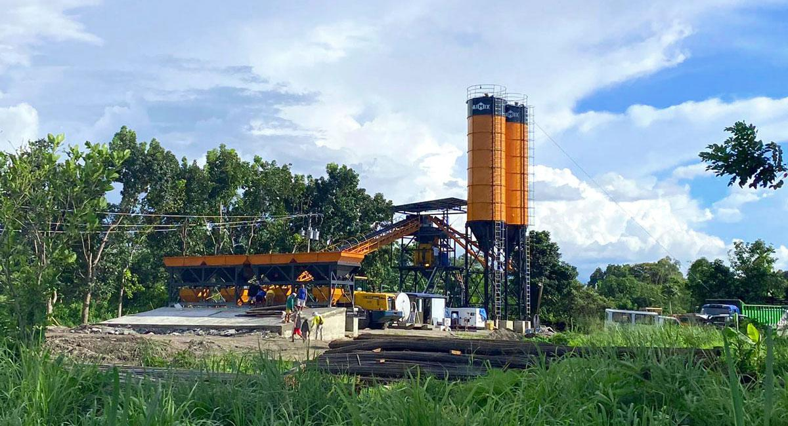
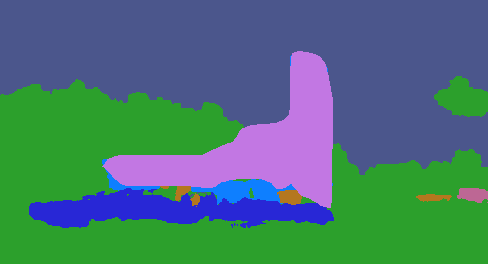

##  3. Implement RICAP

From the above explanation it is clear that each image contains annotation for one of the class custom category and stuff category. But in real life scenario it is not always an ideal situation where we will always have ove category per class, for an example a room can have tiles, paint, furniture, switchboard etc. 

But if a model is trained to only predict one class at a time in an image it will get biased and might not give good results in real world scenarios.

A solution to this problem is to combine images so that they contain multiple categories in one single input. And there is not better technique than RICAP to do this.

We implemented RICAP in side a dataloaded as follows

**Step 1:** First update `__getitem__` to either pich normal image or collage image

    class ConstructionDetection(torchvision.datasets.CocoDetection):
        def __init__(self, img_folder, ann_file, transforms, return_masks, dataset_type):
            super(ConstructionDetection, self).__init__(img_folder, ann_file)
            self._transforms = transforms
            self.prepare = ConvertConstructionPolysToMask(return_masks)
            self.dataset_type = dataset_type
            
        def get_images(self):
            collage_images = list(random.sample(self.ids, 4))
            
            targets = {i: [] for i in collage_images}
            images = {i: [] for i in collage_images}
            
            for imid in collage_images:
                image, target = super(ConstructionDetection, self).__getitem__(imid-1)
                target = {'image_id': imid, 'annotations': target}
                image, target = self.prepare(image, target)
                targets[imid] = target
                images[imid] = image
                
            return images, targets

        def __getitem__(self, idx):
            _flip = flip_coin()
            image_id = self.ids[idx]
            
            if _flip or self.dataset_type == 'val':
                img, target = super(ConstructionDetection, self).__getitem__(idx)
            else:
                images, targets = self.get_images()
                img, target = prepare_collage(images, targets)
            
            target = {'image_id': image_id, 'annotations': target}
            img, target = self.prepare(img, target)
            if self._transforms is not None:
                if self.dataset_type == 'val':
                    img, target = self._transforms(img, target)
                elif _flip:
                    img, target = self._transforms[0](img, target)
                else:
                    img, target = self._transforms[1](img, target)
            return img, target

    def flip_coin():
        if torch.rand(1) > 0.5:
            return True
        else:
            return False

**Step 2:** Define a function which will take in images and their annotations to create a collage out of them

    def prepare_collage(imgs, targets):
        idxs = imgs.keys()
        try:

            bbs = {i: [] for i in idxs}
            cats = {i: [] for i in idxs}

            collage_target = []

            for i in idxs:
                targets[i]["boxes"][:, 2:] -= targets[i]["boxes"][:, :2]
                bbs[i] = targets[i]["boxes"].int().tolist()
                cats[i]= targets[i]["labels"].int().tolist()

            trans_imgs = []
            trans_bbs = torch.tensor([])
            trans_cats = []

            transform = A.Compose(
                [A.SmallestMaxSize(max_size=300), A.CenterCrop(width=300, height=300)],
                bbox_params=A.BboxParams(format='coco', label_fields=['category_ids'], min_visibility=0.5),
            )

            for i in idxs:
                image = np.array(imgs[i])

                transformed = transform(image=image, bboxes=bbs[i], category_ids=cats[i])

                trans_imgs.append(transformed)
                bb_tensor = torch.tensor(transformed['bboxes'])

                if len(bb_tensor) > 0:

                    if i == 1:
                        bb_tensor[:, 1]+=300
                    if i == 2:
                        bb_tensor[:, 0]+=300
                    if i == 3:
                        bb_tensor[:, 0]+=300
                        bb_tensor[:, 1]+=300

                    trans_bbs = torch.cat([trans_bbs, bb_tensor], dim=0)
                    trans_cats += transformed['category_ids']

            collage_image = Image.fromarray(torch.cat([
                torch.cat([
                    torch.tensor(trans_imgs[0]['image']), 
                    torch.tensor(trans_imgs[1]['image'])
                ], dim=0),
                torch.cat([
                    torch.tensor(trans_imgs[2]['image']), 
                    torch.tensor(trans_imgs[3]['image'])
                ], dim=0)
            ], dim=1).detach().numpy())

            for bb, cid, ar in zip(trans_bbs, trans_cats, trans_bbs[:, 2] * trans_bbs[:, 3]):
                collage_target.append({
                'bbox': bb.tolist(),
                'category_id': cid,
                'area': ar
            })
                
        except Exception as e:
            logging.error(idxs)
            raise e
        
        return collage_image, collage_target

###  3.1. Example RICAP Images

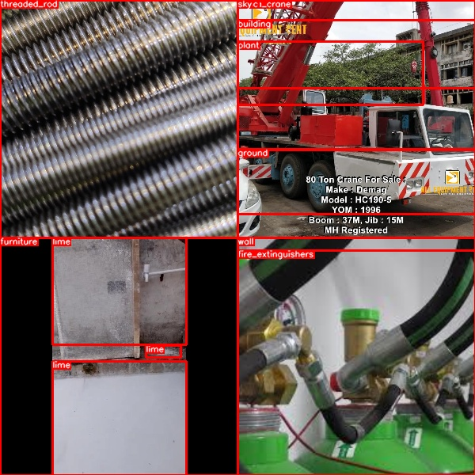
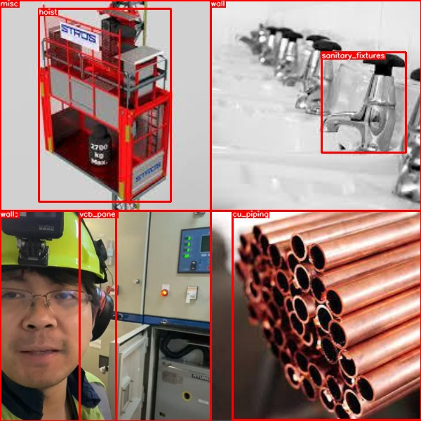
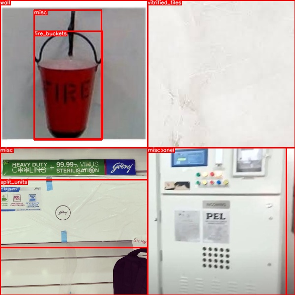
    

##  4. Fine Tune DETR on custom dataset for Object Detection

In this section we will show how to finetune DETR to perform object detection on custom dataset.

First of all thankyou to Facebook Research for providing pretrained DETR model. We will be using [detr-r50](https://dl.fbaipublicfiles.com/detr/detr-r50-e632da11.pth) to train model

Following are the steps to train DETR using pretrained model, most of the content is inspired from [this](https://www.youtube.com/watch?v=RkhXoj_Vvr4) beautiful video

###  4.1. Prepare Code

**Step 1:** First of all download DETR code from github

    git clone https://github.com/facebookresearch/detr.git
    cd detr

**Step 2:** Download pretrained model and put into a directory named weights we will use this to start our training from

    mkdir weights
    cd weights
    wget https://dl.fbaipublicfiles.com/detr/detr-r50-e632da11.pth

**Step 3:** Now we have to create a custom dataloader file the code for which can be found [detr/datasets/construction.py](detr/datasets/construction.py)

**Step 4:** Now we need to make some changes to `/detr/main.py` file starting line no 172 in resume we will add certain lines of code to make sure we do not receive any error. As we are changing number or queries from default number 100 to 20 we will see some errors

Update Number of queries at line no 55
    
    parser.add_argument('--num_queries', default=20, type=int,
                        help="Number of query slots")

Update Preloading code at line no 172

    if args.resume:
        if args.resume.startswith('https'):
            checkpoint = torch.hub.load_state_dict_from_url(
                args.resume, map_location='cpu', check_hash=True)
        else:
            checkpoint = torch.load(args.resume, map_location='cpu')
            
        del checkpoint['model']['class_embed.weight']
        del checkpoint['model']['class_embed.bias']
        del checkpoint['model']['query_embed.weight']
        
        model_without_ddp.load_state_dict(checkpoint['model'], strict=False)
        
        if not args.eval and 'optimizer' in checkpoint and 'lr_scheduler' in checkpoint and 'epoch' in checkpoint:
            optimizer.load_state_dict(checkpoint['optimizer'])
            lr_scheduler.load_state_dict(checkpoint['lr_scheduler'])
            args.start_epoch = checkpoint['epoch'] + 1

**Step 5:** We will add a new condition to dataset builder to use our custom dataset file, go to [detr/datasets/__init__.py](detr/datasets/__init__.py) and replace build_dataset function 

    from .construction import build as build_construction
    
    def build_dataset(image_set, args):
        if args.dataset_file == 'coco':
            return build_coco(image_set, args)
        if args.dataset_file == 'construction':
            return build_construction(image_set, args)
        if args.dataset_file == 'coco_panoptic':
            # to avoid making panopticapi required for coco
            from .coco_panoptic import build as build_coco_panoptic
            return build_coco_panoptic(image_set, args)
        raise ValueError(f'dataset {args.dataset_file} not supported')

**Step 6:** Finally We will update build function in `detr/models/detr.ph` to take care of number of classes at line 313

    # num_classes = 20 if args.dataset_file != 'coco' else 91
    if args.dataset_file == "construction":
        num_classes = 70
    # if args.dataset_file == "coco_panoptic":
        # # for panoptic, we just add a num_classes that is large enough to hold
        # # max_obj_id + 1, but the exact value doesn't really matter
        # num_classes = 250

With all these updates we are ready to train our model.

###  4.2. Train Model

We have trained detr model in two stages for 100 epochs in total in first stage we have trained model for 50 epochs keeping all settings constant and switching RICAP images. Later for next 50 epochs we have trained model with RICAP on for random 50% samples

**Stage 1 Training:** In this stage we have trained model in different steps of 5, 20 and 50 epochs. Initially we trained model with pretrained weights downloaded from hub

    python3 detr/main.py --dataset_file construction --epochs 5 --data_path construction/data --output_dir construction/data/output --resume detr/weights/detr-r50-e632da11.pth

later we resumed from saved checkpoints

    python3 detr/main.py --dataset_file construction --epochs 20 --data_path construction/data --output_dir construction/data/output --resume construction/data/output/checkpoint.pth

Following are the outputs after different stages.

    Accumulating evaluation results...
    DONE (t=0.47s).
    IoU metric: bbox
    Average Precision  (AP) @[ IoU=0.50:0.95 | area=   all | maxDets=100 ] = 0.383
    Average Precision  (AP) @[ IoU=0.50      | area=   all | maxDets=100 ] = 0.495
    Average Precision  (AP) @[ IoU=0.75      | area=   all | maxDets=100 ] = 0.409
    Average Precision  (AP) @[ IoU=0.50:0.95 | area= small | maxDets=100 ] = 0.045
    Average Precision  (AP) @[ IoU=0.50:0.95 | area=medium | maxDets=100 ] = 0.194
    Average Precision  (AP) @[ IoU=0.50:0.95 | area= large | maxDets=100 ] = 0.422
    Average Recall     (AR) @[ IoU=0.50:0.95 | area=   all | maxDets=  1 ] = 0.437
    Average Recall     (AR) @[ IoU=0.50:0.95 | area=   all | maxDets= 10 ] = 0.528
    Average Recall     (AR) @[ IoU=0.50:0.95 | area=   all | maxDets=100 ] = 0.530
    Average Recall     (AR) @[ IoU=0.50:0.95 | area= small | maxDets=100 ] = 0.082
    Average Recall     (AR) @[ IoU=0.50:0.95 | area=medium | maxDets=100 ] = 0.267
    Average Recall     (AR) @[ IoU=0.50:0.95 | area= large | maxDets=100 ] = 0.575
    Training time 2:20:32

    Accumulating evaluation results...
    DONE (t=0.48s).
    IoU metric: bbox
    Average Precision  (AP) @[ IoU=0.50:0.95 | area=   all | maxDets=100 ] = 0.581
    Average Precision  (AP) @[ IoU=0.50      | area=   all | maxDets=100 ] = 0.715
    Average Precision  (AP) @[ IoU=0.75      | area=   all | maxDets=100 ] = 0.612
    Average Precision  (AP) @[ IoU=0.50:0.95 | area= small | maxDets=100 ] = 0.153
    Average Precision  (AP) @[ IoU=0.50:0.95 | area=medium | maxDets=100 ] = 0.366
    Average Precision  (AP) @[ IoU=0.50:0.95 | area= large | maxDets=100 ] = 0.608
    Average Recall     (AR) @[ IoU=0.50:0.95 | area=   all | maxDets=  1 ] = 0.596
    Average Recall     (AR) @[ IoU=0.50:0.95 | area=   all | maxDets= 10 ] = 0.709
    Average Recall     (AR) @[ IoU=0.50:0.95 | area=   all | maxDets=100 ] = 0.711
    Average Recall     (AR) @[ IoU=0.50:0.95 | area= small | maxDets=100 ] = 0.165
    Average Recall     (AR) @[ IoU=0.50:0.95 | area=medium | maxDets=100 ] = 0.452
    Average Recall     (AR) @[ IoU=0.50:0.95 | area= large | maxDets=100 ] = 0.745
    Training time 4:15:31

    Accumulating evaluation results...
    DONE (t=0.48s).
    IoU metric: bbox
    Average Precision  (AP) @[ IoU=0.50:0.95 | area=   all | maxDets=100 ] = 0.695
    Average Precision  (AP) @[ IoU=0.50      | area=   all | maxDets=100 ] = 0.824
    Average Precision  (AP) @[ IoU=0.75      | area=   all | maxDets=100 ] = 0.739
    Average Precision  (AP) @[ IoU=0.50:0.95 | area= small | maxDets=100 ] = 0.240
    Average Precision  (AP) @[ IoU=0.50:0.95 | area=medium | maxDets=100 ] = 0.489
    Average Precision  (AP) @[ IoU=0.50:0.95 | area= large | maxDets=100 ] = 0.722
    Average Recall     (AR) @[ IoU=0.50:0.95 | area=   all | maxDets=  1 ] = 0.675
    Average Recall     (AR) @[ IoU=0.50:0.95 | area=   all | maxDets= 10 ] = 0.801
    Average Recall     (AR) @[ IoU=0.50:0.95 | area=   all | maxDets=100 ] = 0.802
    Average Recall     (AR) @[ IoU=0.50:0.95 | area= small | maxDets=100 ] = 0.282
    Average Recall     (AR) @[ IoU=0.50:0.95 | area=medium | maxDets=100 ] = 0.583
    Average Recall     (AR) @[ IoU=0.50:0.95 | area= large | maxDets=100 ] = 0.834
    Training time 8:35:06

**Stage 2 Training:** In this stage we enabled RICAP and trained model for 50 epochs in total, dividing it into steps of 60, 100 epochs here we used saved model from checkpoint

    python3 detr/main.py --dataset_file construction --epochs 20 --data_path construction/data --output_dir construction/data/output --resume construction/data/output/checkpoint.pth

Following are the outputs after different stages.

    Accumulating evaluation results...
    DONE (t=0.46s).
    IoU metric: bbox
    Average Precision  (AP) @[ IoU=0.50:0.95 | area=   all | maxDets=100 ] = 0.652
    Average Precision  (AP) @[ IoU=0.50      | area=   all | maxDets=100 ] = 0.794
    Average Precision  (AP) @[ IoU=0.75      | area=   all | maxDets=100 ] = 0.689
    Average Precision  (AP) @[ IoU=0.50:0.95 | area= small | maxDets=100 ] = 0.150
    Average Precision  (AP) @[ IoU=0.50:0.95 | area=medium | maxDets=100 ] = 0.460
    Average Precision  (AP) @[ IoU=0.50:0.95 | area= large | maxDets=100 ] = 0.672
    Average Recall     (AR) @[ IoU=0.50:0.95 | area=   all | maxDets=  1 ] = 0.638
    Average Recall     (AR) @[ IoU=0.50:0.95 | area=   all | maxDets= 10 ] = 0.759
    Average Recall     (AR) @[ IoU=0.50:0.95 | area=   all | maxDets=100 ] = 0.762
    Average Recall     (AR) @[ IoU=0.50:0.95 | area= small | maxDets=100 ] = 0.188
    Average Recall     (AR) @[ IoU=0.50:0.95 | area=medium | maxDets=100 ] = 0.540
    Average Recall     (AR) @[ IoU=0.50:0.95 | area= large | maxDets=100 ] = 0.786
    Training time 2:36:29

    Accumulating evaluation results...
    DONE (t=0.50s).
    IoU metric: bbox
    Average Precision  (AP) @[ IoU=0.50:0.95 | area=   all | maxDets=100 ] = 0.688
    Average Precision  (AP) @[ IoU=0.50      | area=   all | maxDets=100 ] = 0.840
    Average Precision  (AP) @[ IoU=0.75      | area=   all | maxDets=100 ] = 0.725
    Average Precision  (AP) @[ IoU=0.50:0.95 | area= small | maxDets=100 ] = 0.166
    Average Precision  (AP) @[ IoU=0.50:0.95 | area=medium | maxDets=100 ] = 0.489
    Average Precision  (AP) @[ IoU=0.50:0.95 | area= large | maxDets=100 ] = 0.714
    Average Recall     (AR) @[ IoU=0.50:0.95 | area=   all | maxDets=  1 ] = 0.656
    Average Recall     (AR) @[ IoU=0.50:0.95 | area=   all | maxDets= 10 ] = 0.785
    Average Recall     (AR) @[ IoU=0.50:0.95 | area=   all | maxDets=100 ] = 0.786
    Average Recall     (AR) @[ IoU=0.50:0.95 | area= small | maxDets=100 ] = 0.208
    Average Recall     (AR) @[ IoU=0.50:0.95 | area=medium | maxDets=100 ] = 0.576
    Average Recall     (AR) @[ IoU=0.50:0.95 | area= large | maxDets=100 ] = 0.813
    Training time 11:22:09

**Final Output after 100 epochs**

    {
        "train_lr": 9.999999999999704e-05,
        "train_class_error": 11.13777310111477,
        "train_loss": 7.0748679395847685,
        "train_loss_ce": 0.47363319006340443,
        "train_loss_bbox": 0.30447620895547545,
        "train_loss_giou": 0.3278437750831709,
        "train_loss_ce_0": 0.5881314368715658,
        "train_loss_bbox_0": 0.3472212653381299,
        "train_loss_giou_0": 0.37600500862393665,
        "train_loss_ce_1": 0.55237008775908,
        "train_loss_bbox_1": 0.32516072706276705,
        "train_loss_giou_1": 0.3517379571613477,
        "train_loss_ce_2": 0.5186218701306677,
        "train_loss_bbox_2": 0.31581294863402637,
        "train_loss_giou_2": 0.34194779435164413,
        "train_loss_ce_3": 0.4926084234627554,
        "train_loss_bbox_3": 0.3095761377083486,
        "train_loss_giou_3": 0.33506769407127457,
        "train_loss_ce_4": 0.4794388437040514,
        "train_loss_bbox_4": 0.3054348684740866,
        "train_loss_giou_4": 0.329779693907326,
        "train_loss_ce_unscaled": 0.47363319006340443,
        "train_class_error_unscaled": 11.13777310111477,
        "train_loss_bbox_unscaled": 0.0608952418235927,
        "train_loss_giou_unscaled": 0.16392188754158546,
        "train_cardinality_error_unscaled": 3.4914736962189163,
        "train_loss_ce_0_unscaled": 0.5881314368715658,
        "train_loss_bbox_0_unscaled": 0.06944425303549559,
        "train_loss_giou_0_unscaled": 0.18800250431196833,
        "train_cardinality_error_0_unscaled": 4.101626492416171,
        "train_loss_ce_1_unscaled": 0.55237008775908,
        "train_loss_bbox_1_unscaled": 0.06503214538207543,
        "train_loss_giou_1_unscaled": 0.17586897858067385,
        "train_cardinality_error_1_unscaled": 3.9997043615494414,
        "train_loss_ce_2_unscaled": 0.5186218701306677,
        "train_loss_bbox_2_unscaled": 0.063162589752326,
        "train_loss_giou_2_unscaled": 0.17097389717582206,
        "train_cardinality_error_2_unscaled": 3.8115328446199532,
        "train_loss_ce_3_unscaled": 0.4926084234627554,
        "train_loss_bbox_3_unscaled": 0.06191522753561084,
        "train_loss_giou_3_unscaled": 0.16753384703563728,
        "train_cardinality_error_3_unscaled": 3.557121799387563,
        "train_loss_ce_4_unscaled": 0.4794388437040514,
        "train_loss_bbox_4_unscaled": 0.06108697369913196,
        "train_loss_giou_4_unscaled": 0.164889846953663,
        "train_cardinality_error_4_unscaled": 3.552094690975384,
        "test_class_error": 11.55502628326416,
        "test_loss": 6.140124481916428,
        "test_loss_ce": 0.3836157451570034,
        "test_loss_bbox": 0.3225858848169446,
        "test_loss_giou": 0.25822939176112414,
        "test_loss_ce_0": 0.49365687247365714,
        "test_loss_bbox_0": 0.369282574057579,
        "test_loss_giou_0": 0.2898290537111461,
        "test_loss_ce_1": 0.4531397996097803,
        "test_loss_bbox_1": 0.3391037554293871,
        "test_loss_giou_1": 0.2677661120519042,
        "test_loss_ce_2": 0.42305747225880624,
        "test_loss_bbox_2": 0.33201476439833644,
        "test_loss_giou_2": 0.257948488779366,
        "test_loss_ce_3": 0.398946150764823,
        "test_loss_bbox_3": 0.327679091244936,
        "test_loss_giou_3": 0.2583477924391627,
        "test_loss_ce_4": 0.3836481772735715,
        "test_loss_bbox_4": 0.3244562655314803,
        "test_loss_giou_4": 0.25681708943098785,
        "test_loss_ce_unscaled": 0.3836157451570034,
        "test_class_error_unscaled": 11.55502628326416,
        "test_loss_bbox_unscaled": 0.06451717694289982,
        "test_loss_giou_unscaled": 0.12911469588056207,
        "test_cardinality_error_unscaled": 2.6660000497102736,
        "test_loss_ce_0_unscaled": 0.49365687247365714,
        "test_loss_bbox_0_unscaled": 0.07385651474818587,
        "test_loss_giou_0_unscaled": 0.14491452685557304,
        "test_cardinality_error_0_unscaled": 3.5520000767707827,
        "test_loss_ce_1_unscaled": 0.4531397996097803,
        "test_loss_bbox_1_unscaled": 0.06782075129449368,
        "test_loss_giou_1_unscaled": 0.1338830560259521,
        "test_cardinality_error_1_unscaled": 3.210000049471855,
        "test_loss_ce_2_unscaled": 0.42305747225880624,
        "test_loss_bbox_2_unscaled": 0.06640295236371457,
        "test_loss_giou_2_unscaled": 0.128974244389683,
        "test_cardinality_error_2_unscaled": 2.8980000519752505,
        "test_loss_ce_3_unscaled": 0.398946150764823,
        "test_loss_bbox_3_unscaled": 0.06553581827320158,
        "test_loss_giou_3_unscaled": 0.12917389621958136,
        "test_cardinality_error_3_unscaled": 2.754000053703785,
        "test_loss_ce_4_unscaled": 0.3836481772735715,
        "test_loss_bbox_4_unscaled": 0.06489125317893922,
        "test_loss_giou_4_unscaled": 0.12840854471549393,
        "test_cardinality_error_4_unscaled": 2.672000054717064,
        "test_coco_eval_bbox": [
            0.6884138366417941,
            0.8399256198314273,
            0.7245752109267217,
            0.16603419686455426,
            0.48891115281802155,
            0.7141360017823284,
            0.6557239102631593,
            0.7852920544274031,
            0.7862828597078847,
            0.20753684082328586,
            0.5762838930641595,
            0.8128154685936025
        ],
        "epoch": 99,
        "n_parameters": 41276491
    }

##  5. Example Predictions

You can find some of example predictions here [./assets/predictions](./assets/predictions)

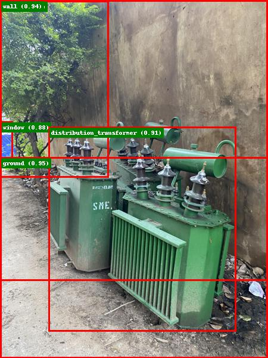

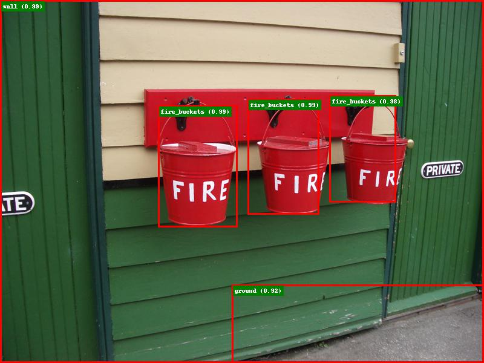

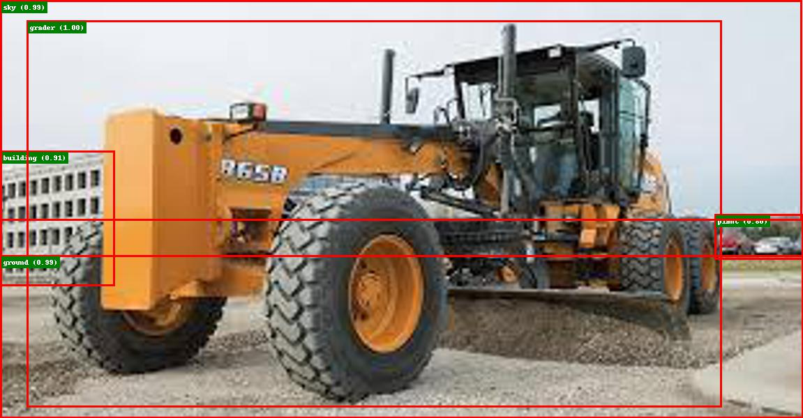

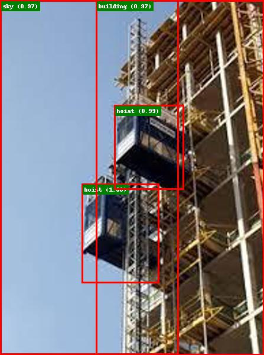

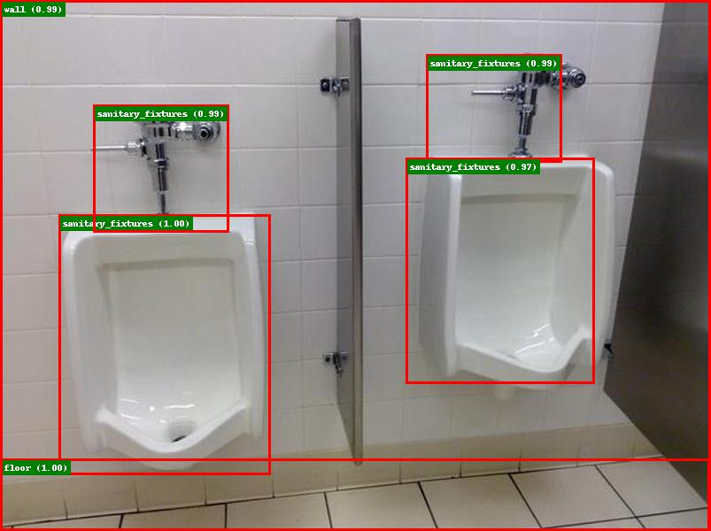

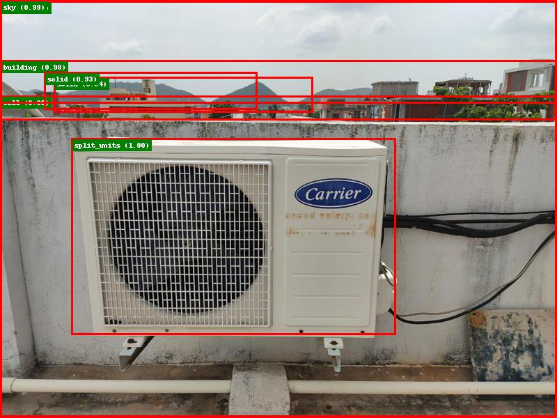

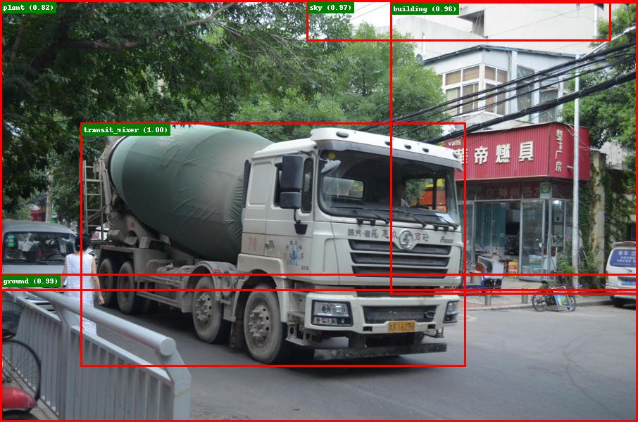

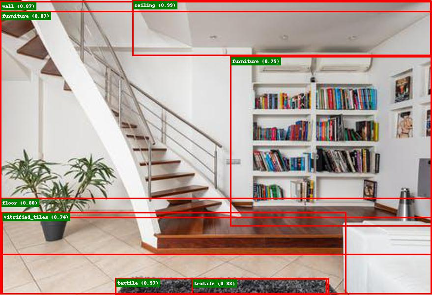

##  6. References:

* https://towardsdatascience.com/how-to-work-with-object-detection-datasets-in-coco-format-9bf4fb5848a4