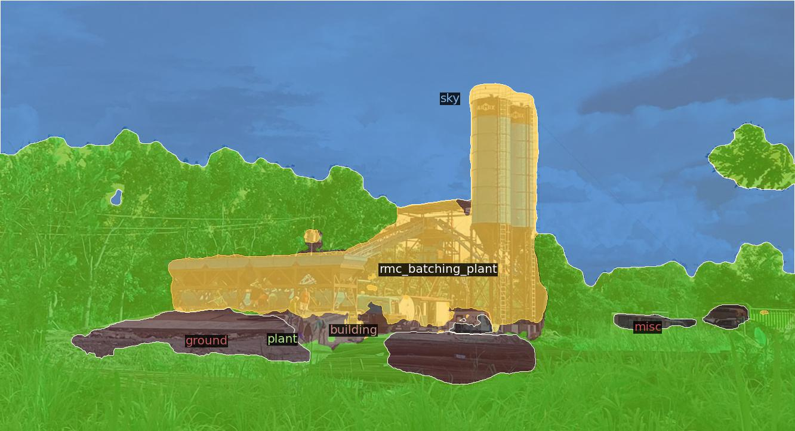

# Train DETR for Panoptic Segmentation

Computer vision and scene understanding have become game-changer in today’s world. As we move forward into giving autonomous capabilities to machines to perform tasks in a human-way fashion, understanding the surroundings, objects around, and scenes becomes pivotal. 

Panoptic segmentation combines instance segmentation and semantic segmentation to provide a more holistic understanding of a given scene than the latter two alone. In this post, I will walk you through the concept of panoptic segmentation and how it is helping machines to view the world the way we see it.


## What is Segmentation
### Semantic Segmentation

Semantic segmentation refers to the task of classifying pixels in an image. It is done by predefining some target classes, e.g., “car”, “vegetation”, “road”, “sky”, “sidewalk”, or “background”, where “background” is in most cases a default class. Then, each pixel in the image is assigned to one of those classes. Here’s an example:

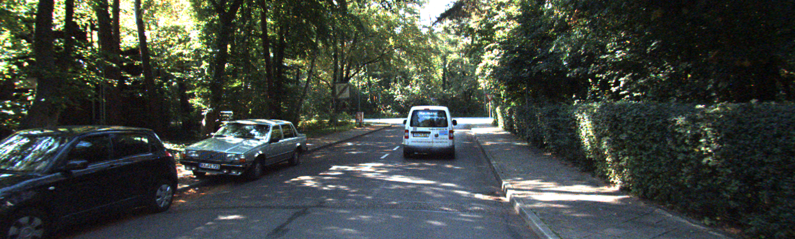

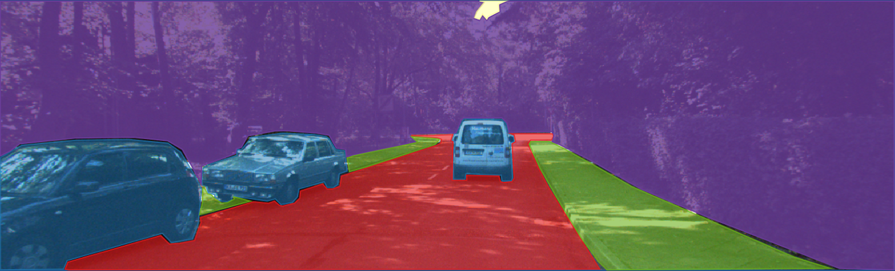

As you can see in the previous example, every pixel in the image was colored depending on its class; hence, every pixel belonging to a car is masked in blue and the same goes for the sidewalk, the vegetation, road, and the sky.

if we want to dig deeper into the type of information we can extract here. Say, for example, we want to know how many cars are in one picture. Semantic segmentation is of no help here as all we can get is a pixel-wise classification. For such a task, we need to introduce the concept of object detection and instance segmentation.

### Object Detection and Instance Segmentation

When we do object detection, we aim to identify bounded regions of interest within the image inside of which is an object. Such objects are countable things such as cars, people, pets, etc. It doesn’t apply to classes such as “sky” or “vegetation” since they are usually spread in different regions of the image, and you cannot count them one by one since there’s only one instance of them — there is only one “sky” not multiple.

It is very common to use bounding boxes to indicate the region within which we will find a given object. Here’s an example:

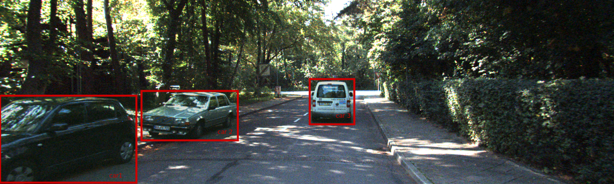

In the previous image, there are three bounding boxes, one for each car on the image. In other words, we are detecting cars, and we can now say how many of them are in the image.

Now, not all the pixels inside those bounding boxes correspond to a car. Some of those pixels are part of the road; others of the sidewalk or the vegetation. If we want to obtain richer information from object detection, we can identify what pixels specifically belong to the same class assigned to the bounding box. That is what is called instance segmentation. Strictly speaking, we perform pixel-wise segmentation for every instance (bounding box in our case) we detected. This is what it looks like:

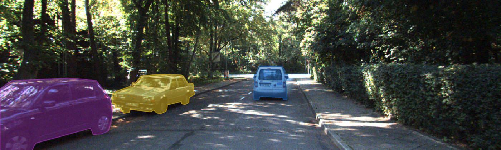

So we went from a rough detection with a bounding box to a more accurate detection in which we can also identify instances and therefore count the number of objects of a given class. In addition to that, we know exactly what pixels belong to an object.

Still we have no information about all the other non-instance classes such as “road”, “vegetation” or “sidewalk” as we did have it in semantic segmentation. That is when panoptic segmentation comes into play!

### Panoptic Segmentation

As mentioned in the introduction of this post, panoptic segmentation is a combination of semantic segmentation and instance segmentation. To put it another way , with panoptic segmentation, we can obtain information such as the number of objects for every instance class (countable objects), bounding boxes, instance segmentation. But, also we get to know what class every pixel in the image belongs to using semantic segmentation. This certainly provides a more holistic understanding of a scene.

Following our example, panoptic segmentation would look like this:

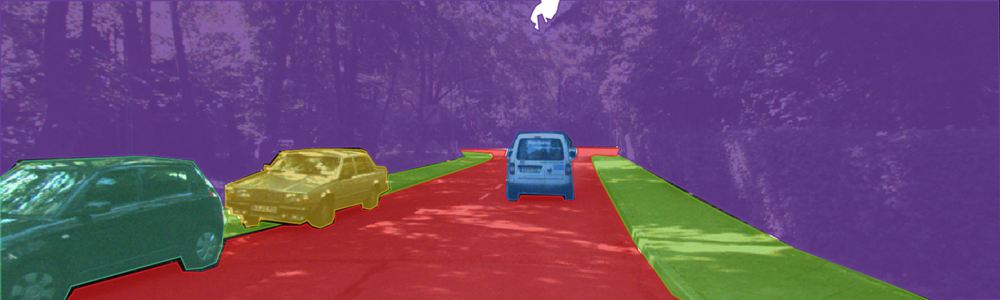

We have now managed to get a representation of the original image in such a way that it provides rich information about both semantic and instance classes altogether.


## Train DETR

Training DETR is a two step process

1. First [train DETR for Object detection](./README.md)
2. Then add panoptic mask head and freeze base network and further train for a couple of epochs


In our [previous article](./README.md) we have shown how to create a custom dataset from scratch and train Object Detection Model on the same. We have trained object detection model in multiple steps for around 150 epochs.

In this step we are adding Panoptic head on top of base DETR model and train it for another 150 epochs. But in this part we will train panoptic head with base model for first 500 epochs then we are goiong to freeze object detection model and train further for 50 epochs.

### Steps

**Step 1:** Create Data Loader at [detr/datasets/construction_panoptic.py](./detr/datasets/construction_panoptic.py)

    # Copyright (c) Facebook, Inc. and its affiliates. All Rights Reserved
    import json
    from pathlib import Path

    import numpy as np
    import torch
    from PIL import Image

    from panopticapi.utils import rgb2id
    # from util.box_ops import masks_to_boxes

    from .construction import make_construction_transforms

    import logging


    def box_xywh_to_xyxy(x):
        xs, ys, w, h = x.unbind(-1)
        b = [xs, ys, (xs + w), (ys + h)]
        return torch.stack(b, dim=-1)


    def masks_to_boxes(segments):
        boxes = []
        labels = []
        iscrowd = []
        area = []

        for ann in segments:
            if len(ann["bbox"]) == 4:
                boxes.append(ann["bbox"])
                area.append(ann['area'])
            else:
                boxes.append([0, 0, 2, 2])
                area.append(4)
            labels.append(ann["category_id"])
            iscrowd.append(ann['iscrowd'])
        
        if len(boxes) == 0 and len(labels) == 0:
            boxes.append([0, 0, 2, 2])
            labels.append(1)
            area.append(4)
            iscrowd.append(0)

        boxes = torch.tensor(boxes, dtype=torch.int64)
        labels = torch.tensor(labels, dtype=torch.int64)
        iscrowd = torch.tensor(iscrowd)
        area = torch.tensor(area)
        boxes = box_xywh_to_xyxy(boxes)
        return boxes, labels, iscrowd, area

    class ConstructionPanoptic:
        def __init__(self, img_folder, ann_folder, ann_file, transforms=None, return_masks=True):
            with open(ann_file, "r") as f:
                self.coco = json.load(f)

            # sort 'images' field so that they are aligned with 'annotations'
            # i.e., in alphabetical order
            self.coco["images"] = sorted(self.coco["images"], key=lambda x: x["id"])
            # sanity check
            if "annotations" in self.coco:
                for img, ann in zip(self.coco["images"], self.coco["annotations"]):
                    assert img["file_name"][:-4] == ann["file_name"][:-4]

            self.img_folder = img_folder
            self.ann_folder = ann_folder
            self.ann_file = ann_file
            self.transforms = transforms
            self.return_masks = return_masks

        def __getitem__(self, idx):
            try:
                ann_info = (
                    self.coco["annotations"][idx]
                    if "annotations" in self.coco
                    else self.coco["images"][idx]
                )
                img_path = Path(self.img_folder) / ann_info["file_name"].replace(".png", ".jpg")
                ann_path = Path(self.ann_folder) / ann_info["file_name"]

                img = Image.open(img_path).convert("RGB")
                w, h = img.size
                if "segments_info" in ann_info:
                    masks = np.asarray(Image.open(ann_path), dtype=np.uint32)
                    masks = rgb2id(masks)

                    ids = np.array([ann["id"] for ann in ann_info["segments_info"]])
                    masks = masks == ids[:, None, None]

                    masks = torch.as_tensor(masks, dtype=torch.uint8)
                    
                    # labels = torch.tensor(
                    #     [ann["category_id"] for ann in ann_info["segments_info"]],
                    #     dtype=torch.int64,
                    # )


                target = {}
                target['image_id'] = torch.tensor([ann_info['image_id'] if "image_id" in ann_info else ann_info["id"]])
                if self.return_masks:
                    target['masks'] = masks

                boxes, labels, iscrowd, area = masks_to_boxes(ann_info["segments_info"])

                target['labels'] = labels

                # Instead of finding boxes, just take the one from json info available 
                # target["boxes"] = masks_to_boxes(ann_info["segments_info"])
                target["boxes"] = boxes


                target['size'] = torch.as_tensor([int(h), int(w)])
                target['orig_size'] = torch.as_tensor([int(h), int(w)])

                target['iscrowd'] = iscrowd
                target['area'] = area
                # if "segments_info" in ann_info:
                #     for name in ['iscrowd', 'area']:
                #         target[name] = torch.tensor([ann[name] for ann in ann_info['segments_info']])

                if self.transforms is not None:
                    img, target = self.transforms(img, target)

                return img, target

            except Exception as e:
                logging.error(ann_info)
                raise e


        def __len__(self):
            return len(self.coco['images'])

        def get_height_and_width(self, idx):
            img_info = self.coco['images'][idx]
            height = img_info['height']
            width = img_info['width']
            return height, width


    def build(image_set, args):
        root = Path(args.data_path)
        assert (
            root.exists()
        ), f"provided Panoptic path {root} does not exist"

        mode = "panoptic"

        PATHS = {
            "train": ("images", f"{mode}", f"{mode}.json"),
            "val": ("images", f"val_{mode}", f"val_{mode}.json"),
        }

        img_folder, ann_folder, ann_file = PATHS[image_set]
        img_folder_path = root / img_folder
        ann_folder_path = root / ann_folder
        ann_file = root / ann_file

        dataset = ConstructionPanoptic(
            img_folder_path,
            ann_folder_path,
            ann_file,
            transforms=make_construction_transforms(image_set),
            return_masks=args.masks,
        )

        return dataset


**Step 2:** Update [detr/main.py](./detr/main.py), Add following at line 164

    if args.dataset_file == "construction_panoptic":
        # We also evaluate AP during panoptic training, on original construction DS
        coco_val = datasets.construction.build("val", args)
        base_ds = get_coco_api_from_dataset(coco_val)
    else:
        base_ds = get_coco_api_from_dataset(dataset_val)


**Step 3:** Comment line 183, 184, 185 which we added in previous article for deleting weights

    # del checkpoint['model']['class_embed.weight']
    # del checkpoint['model']['class_embed.bias']
    # del checkpoint['model']['query_embed.weight']


**Step 4:** Comment line 171, 172, 173 as we are not goinng to freeze base model initially

    # if args.frozen_weights is not None:
    #     checkpoint = torch.load(args.frozen_weights, map_location='cpu')
    #     model_without_ddp.detr.load_state_dict(checkpoint['model'])


**Step 5:** Also comment line 190, 191 as we are not going to load optimizer state and lr scheduler state from checkpoint

    # optimizer.load_state_dict(checkpoint['optimizer'])
    # lr_scheduler.load_state_dict(checkpoint['lr_scheduler'])


**Step 6:** Go to file [detr/models/detr.py](./detr/models/detr.py), and add following to line 314

    if args.dataset_file == "construction":
        num_classes = 70
    if args.dataset_file == "construction_panoptic":
        num_classes = 70


**Step 7:** Also we have to update things map, go to line 359 and add following

    if args.dataset_file == "construction_panoptic":
            is_thing_map = {i: i >= 17 for i in range(65)}

With all these updates we are ready to train our model.

### Train model with panoptic head

We have trained model in two steps in first step we have trained model for 100 epochs and in second step for 50 epochs. FIrst stage was trained without frozen weights and second stage was trained with frozen weights.

**Stage 1 Training**

    python3 detr/main.py \
        --masks \
        --epochs 100 \
        --lr_drop 15 \
        --data_path /home/ammar/projects/construction/data \
        --dataset_file construction_panoptic \
        --resume construction/data/output/checkpoint.pth \
        --output_dir construction/data/output \
        > train.log 2>&1 &

Following are the results after 1st stage of training

```
          |    PQ     SQ     RQ     N
--------------------------------------
All       |  46.2   71.1   60.0    59
Things    |  52.5   72.4   67.3    44
Stuff     |  27.9   67.4   38.4    15
```

**Stage 2 Training**

Befor starting this stage we will uncomment some lines in code which we have commented previously. Go to main.py file at line 190 and 191 and uncomment it

Then run following command for 

    python3 detr/main.py \
        --masks \
        --epochs 150 \
        --lr_drop 15 \
        --data_path /home/ammar/projects/construction/data \
        --dataset_file construction_panoptic \
        --frozen_weights True \
        --resume construction/data/output/checkpoint.pth \
        --output_dir construction/data/output \
        > train.log 2>&1 &


Following are the results after 1st stage of training

```
          |    PQ     SQ     RQ     N
--------------------------------------
All       |  47.9   71.8   61.2    59
Things    |  54.2   73.2   68.2    44
Stuff     |  29.4   67.5   40.6    15
```


**Final Output after 150 epochs**

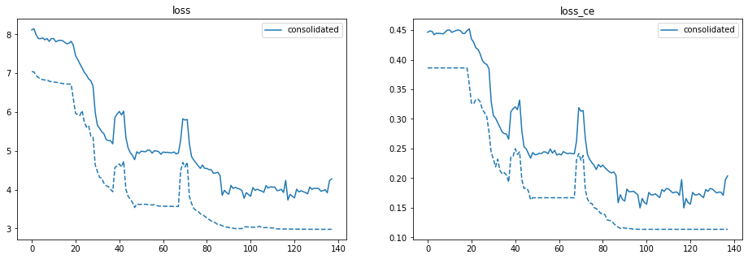
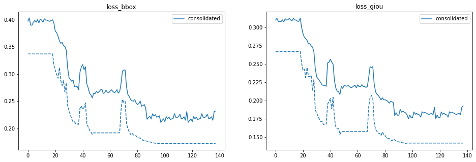
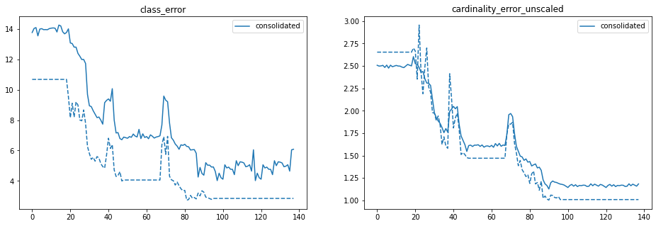


## Example Predictions

You can find some of example predictions here [./assets/panoptic](./assets/panoptic)

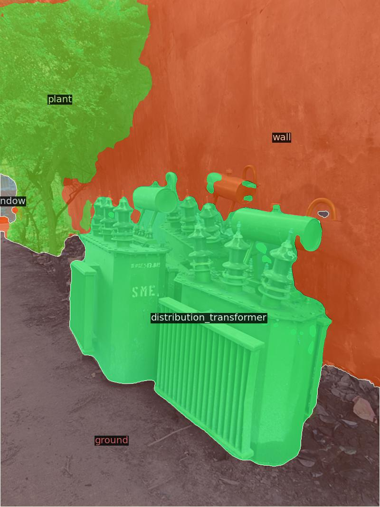

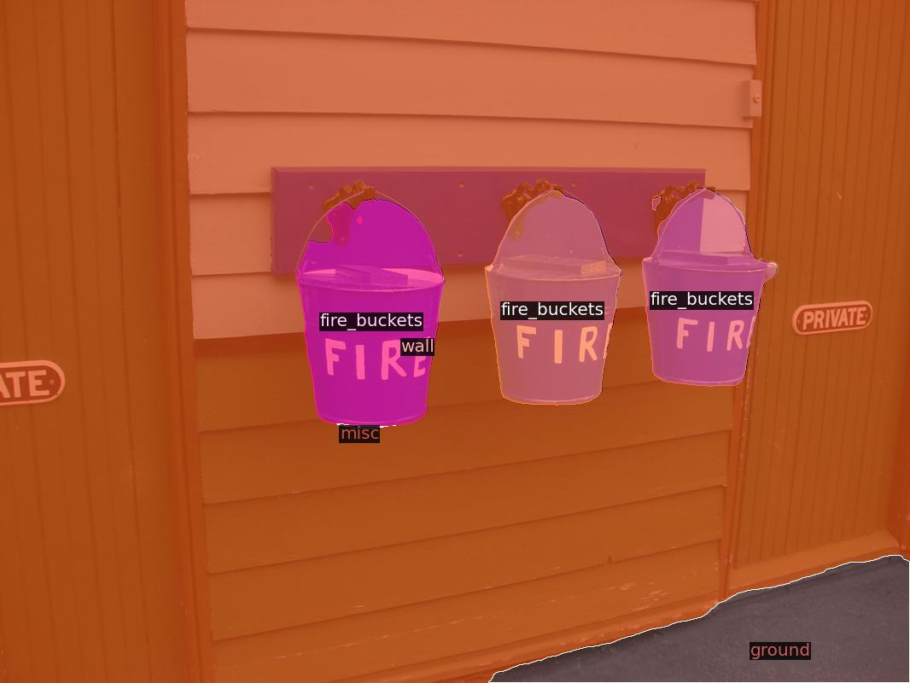

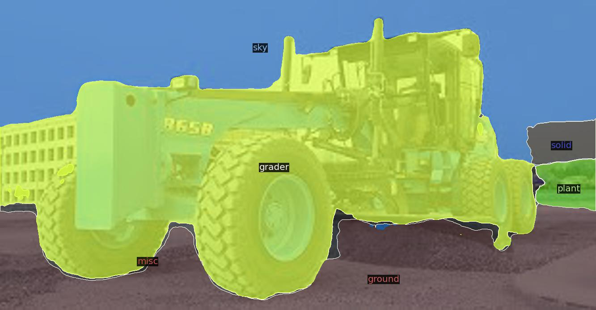

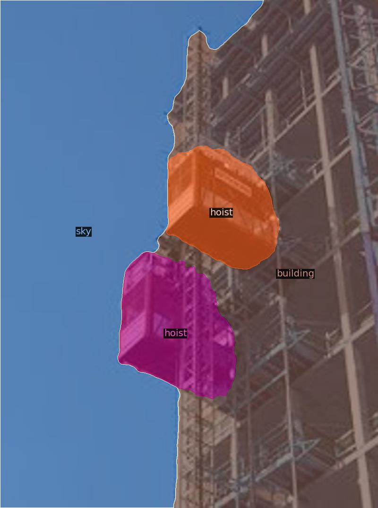

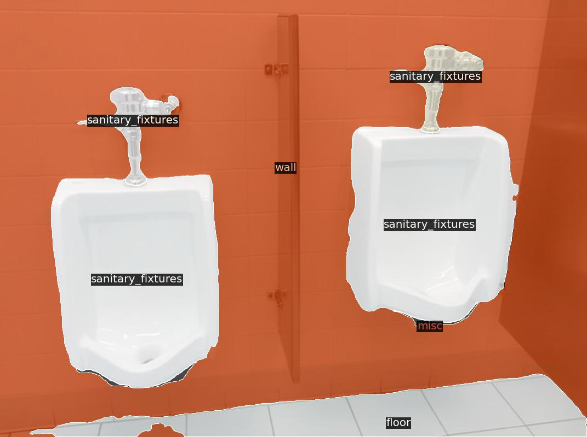

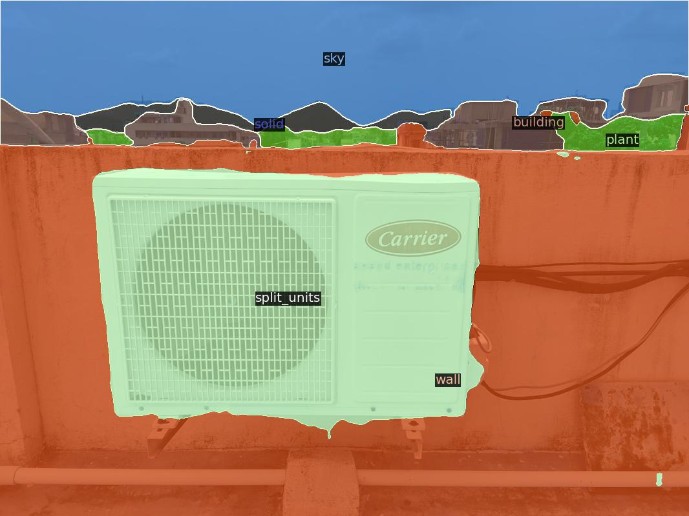

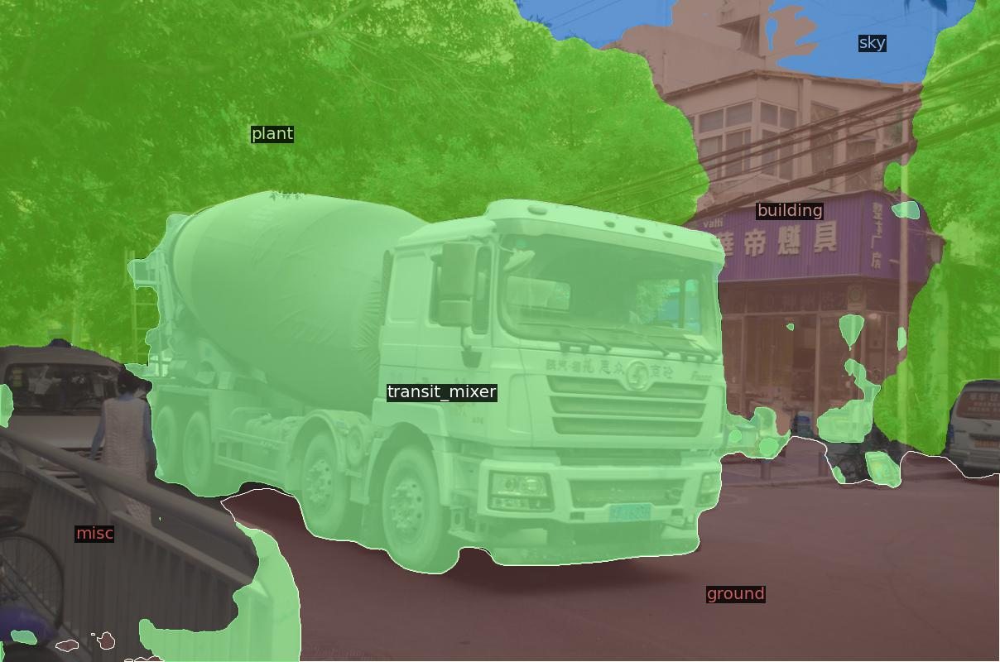

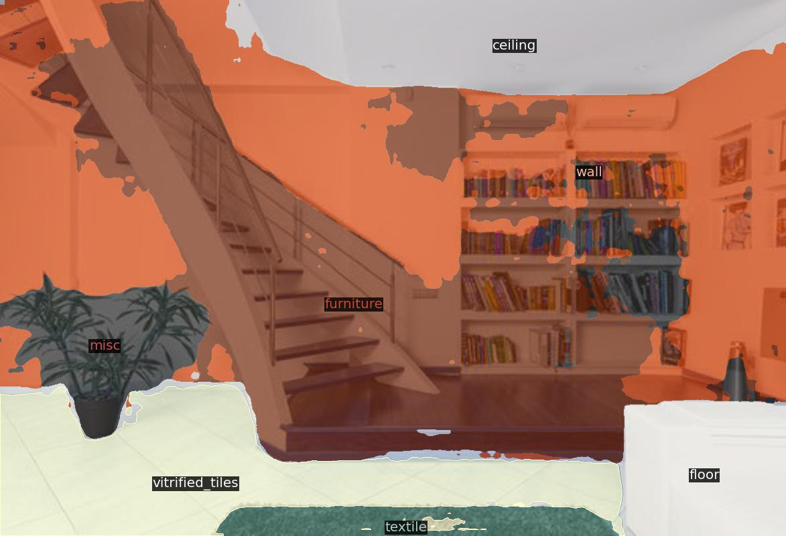

## References

* [Panoptic Segmentation Explained](https://hasty.ai/blog/panoptic-segmentation-explained)
* [END-to-END object detection (Facebook AI)](https://ai.facebook.com/blog/end-to-end-object-detection-with-transformers)
* [Attention is All you Need](https://proceedings.neurips.cc/paper/2017/file/3f5ee243547dee91fbd053c1c4a845aa-Paper.pdf)
* [The Annotated DETR](https://amaarora.github.io/2021/07/26/annotateddetr.html)
* [Facebook DETR: Transformers dive into the Object Detection World](https://towardsdatascience.com/facebook-detr-transformers-dive-into-the-object-detection-world-39d8422b53fa)