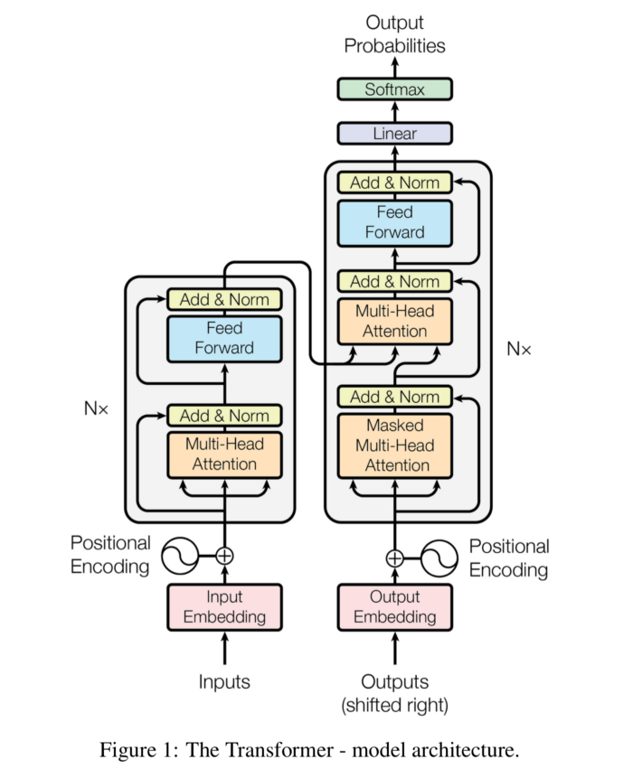
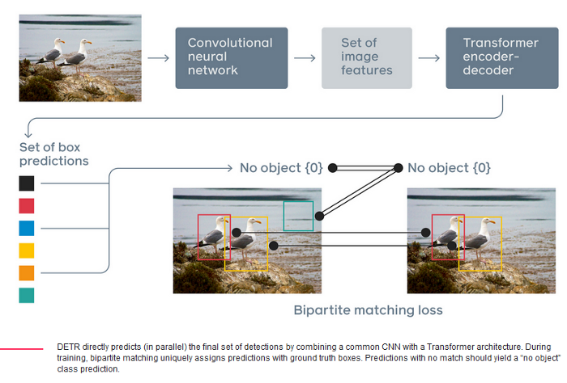

# Train DETR for Panoptic Segmentation

Computer vision and scene understanding have become game-changer in today’s world. As we move forward into giving autonomous capabilities to machines to perform tasks in a human-way fashion, understanding the surroundings, objects around, and scenes becomes pivotal. 

Panoptic segmentation combines instance segmentation and semantic segmentation to provide a more holistic understanding of a given scene than the latter two alone. In this post, I will walk you through the concept of panoptic segmentation and how it is helping machines to view the world the way we see it.


## What is Segmentation
### Semantic Segmentation

Semantic segmentation refers to the task of classifying pixels in an image. It is done by predefining some target classes, e.g., “car”, “vegetation”, “road”, “sky”, “sidewalk”, or “background”, where “background” is in most cases a default class. Then, each pixel in the image is assigned to one of those classes. Here’s an example:


As you can see in the previous example, every pixel in the image was colored depending on its class; hence, every pixel belonging to a car is masked in blue and the same goes for the sidewalk, the vegetation, road, and the sky.

if we want to dig deeper into the type of information we can extract here. Say, for example, we want to know how many cars are in one picture. Semantic segmentation is of no help here as all we can get is a pixel-wise classification. For such a task, we need to introduce the concept of object detection and instance segmentation.

### Object Detection and Instance Segmentation

When we do object detection, we aim to identify bounded regions of interest within the image inside of which is an object. Such objects are countable things such as cars, people, pets, etc. It doesn’t apply to classes such as “sky” or “vegetation” since they are usually spread in different regions of the image, and you cannot count them one by one since there’s only one instance of them — there is only one “sky” not multiple.

It is very common to use bounding boxes to indicate the region within which we will find a given object. Here’s an example:


In the previous image, there are three bounding boxes, one for each car on the image. In other words, we are detecting cars, and we can now say how many of them are in the image.

Now, not all the pixels inside those bounding boxes correspond to a car. Some of those pixels are part of the road; others of the sidewalk or the vegetation. If we want to obtain richer information from object detection, we can identify what pixels specifically belong to the same class assigned to the bounding box. That is what is called instance segmentation. Strictly speaking, we perform pixel-wise segmentation for every instance (bounding box in our case) we detected. This is what it looks like:


So we went from a rough detection with a bounding box to a more accurate detection in which we can also identify instances and therefore count the number of objects of a given class. In addition to that, we know exactly what pixels belong to an object.

Still we have no information about all the other non-instance classes such as “road”, “vegetation” or “sidewalk” as we did have it in semantic segmentation. That is when panoptic segmentation comes into play!

### Panoptic Segmentation

As mentioned in the introduction of this post, panoptic segmentation is a combination of semantic segmentation and instance segmentation. To put it another way , with panoptic segmentation, we can obtain information such as the number of objects for every instance class (countable objects), bounding boxes, instance segmentation. But, also we get to know what class every pixel in the image belongs to using semantic segmentation. This certainly provides a more holistic understanding of a scene.

Following our example, panoptic segmentation would look like this:


We have now managed to get a representation of the original image in such a way that it provides rich information about both semantic and instance classes altogether.


## DETR in depth

In DETR, object detection problem is modeled as a direct set prediction problem. This approach does not require hand crafted algorithms like `non-maximum suppression` procedure or `anchor generation` that explicitly encode our prior knowledge about the task. It makes the detection pipeline a simple end to end unified architecture. The two components of the new framework, called `DEtection TRansformer or DETR`

* Set-based global loss that forces unique predictions via bipartite matching.
* Transformer encoder-decoder architecture.

Given a fixed small set of learned object queries, DETR reasons about relations of  objects and global image context to directly output final set of predictions in parallel.


**How DETR differs from other object detection methods?**

DETR formulates the object detection task as an image-to-set problem. Given an image, the model predicts an unordered set of all objects present, each represented by its class and tight bounding box surrounding each one. Transformer then acts as a reasoning agent between the image features and the prediction.

### What is a transformer?

The paper ‘Attention Is All You Need’ introduces a novel architecture called Transformer. As the title indicates, it uses the attention-mechanism. Like LSTM, Transformer is an architecture for transforming one sequence into another one with the help of two parts (Encoder and Decoder), but it differs from the previously described/existing sequence-to-sequence models because it does not imply any Recurrent Networks (GRU, LSTM, etc.)



In the above architecture lest part is Encoder and right part us Decoder. Both Encoder and Decoder are composed of modules that can be stacked on top of each other multiple times, which is shown as `Nx` above. These modules consist mainly of Multi-Head Attention and Feed Forward layers. 


> Transformers rely on a simple yet powerful mechanism called attention, which enables AI models to selectively focus on certain parts of their input and thus reason more effectively.


Transformers have been widely applied on problems with sequential data, in particular in natural language processing (NLP) tasks such as [language modeling](https://ai.facebook.com/blog/roberta-an-optimized-method-for-pretraining-self-supervised-nlp-systems/) and [machine translation](https://ai.facebook.com/blog/facebook-leads-wmt-translation-competition/), and have also been extended to tasks as diverse as [speech recognition](https://engineering.fb.com/ai-research/wav2letter/), [symbolic mathematics](https://ai.facebook.com/blog/using-neural-networks-to-solve-advanced-mathematics-equations/), and [reinforcement learning](https://arxiv.org/abs/2002.09402). But, perhaps surprisingly, computer vision was not swept up by the Transformer revolution before DETR came into existance.


> DETR completely changes the architecture compared with previous object detection systems. It is the first object detection framework to successfully integrate Transformers as a central building block in the detection pipeline


### DETR Pipeline




At a high level these are the tasks detr perform 

1. Calculate image features from a backbone.
2. Transform image features using Encoder Decoder Architecture.
3. Calculate Set loss function which performs bipartite matching between predicted and ground-truth objects to remove false or extra detection's.


## Metrics

```
          |    PQ     SQ     RQ     N
--------------------------------------
All       |  35.8   67.3   49.2    59
Things    |  40.2   69.6   54.8    44
Stuff     |  22.8   60.6   32.8    15
```


## References

* [Panoptic Segmentation Explained](https://hasty.ai/blog/panoptic-segmentation-explained)
* [END-to-END object detection](https://ai.facebook.com/blog/end-to-end-object-detection-with-transformers)
* [Attention is All you Need](https://proceedings.neurips.cc/paper/2017/file/3f5ee243547dee91fbd053c1c4a845aa-Paper.pdf)